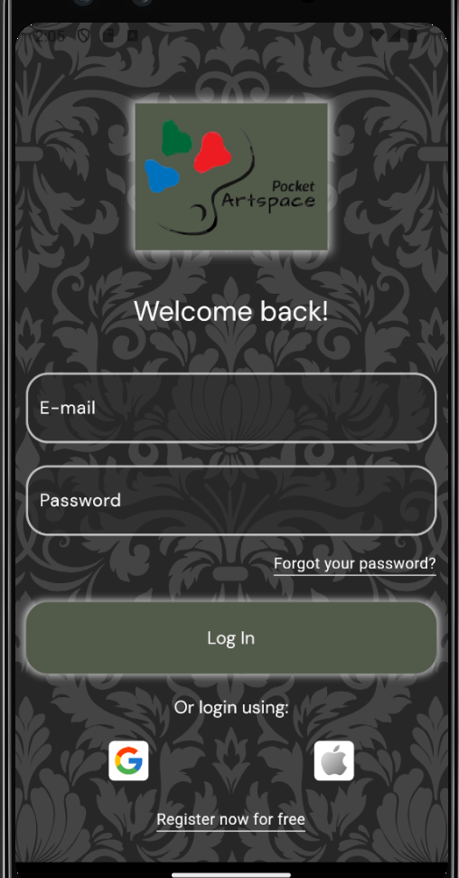
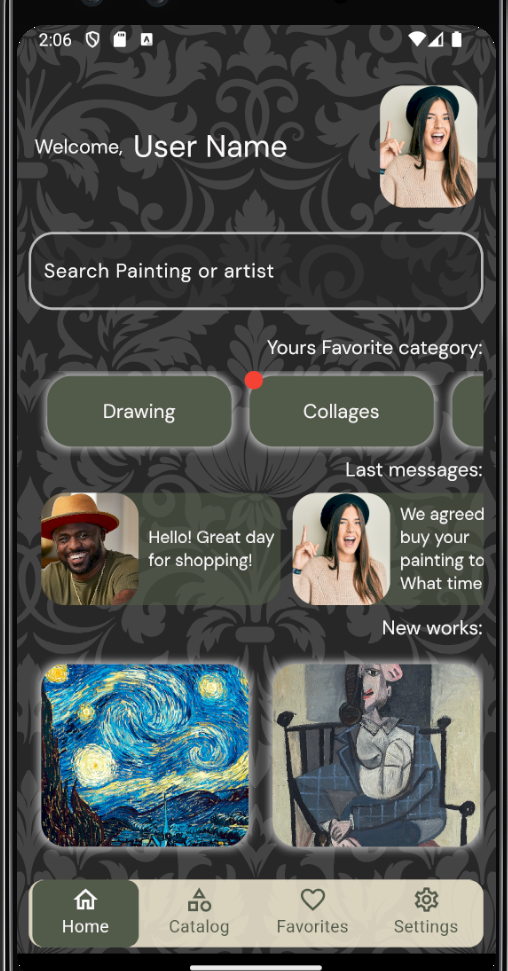
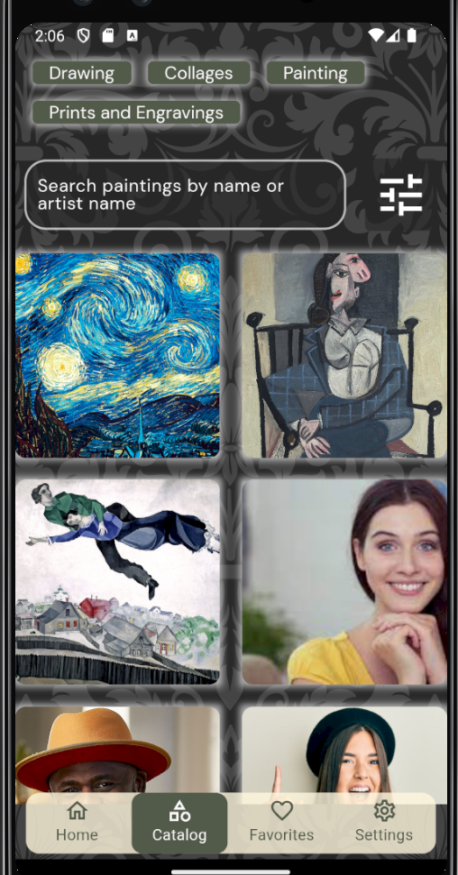
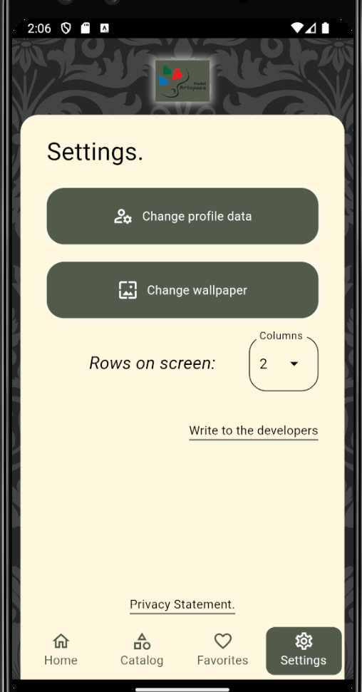

# Pocket Art Space.

> A gallery of paintings ( and other types of fine art ), artists and art fans on Flutter.

---

[Description](#description) •
[Project setup](#project-setup) •
[Features](#features) •
[How To Use](#how-to-use) •
[Project Status](#project-status) •
[Room for Improvement](#room-for-improvement) •
[License](#license) •
[Contact](#contact)

## Description

Pocket Art Space is an aggregator of fine art, authors and art fans.  
This gives you the opportunity to show your work, admire others, discuss and, of course, contact the artist and make a purchase.  
Convenient search by categories, titles of works and authors.  
Favorites page so that your favorite works are always at hand, with the same convenient search.  
An opportunity to learn more about the author, tell about yourself and find like-minded people.  

## Project setup

- Clone this repo to your desktop.
- May be needed run `flutter packages get` or click Get packages button in IDE to install all the dependencies.
- Launch the emulator or connect your smartphone.
- Run the application in your IDE (Run -> Run Without Debugging for VSCODE).
- Enjoy.

## Features

- Svg icons;
- Google fonts;

## How To Use

## Project Status

Project is: _in progress_

## Room for Improvement

To do:

- [ ] Design refactoring.
- [ ] Implement user screen.
- [ ] Implement painting screen.
- [ ] Implement massager screen.
- [ ] add Firebase.
- [ ] add Hive local storage.

Improvement:

- [ ] Add animation.
- [ ] Add localization;
- [ ] Implement toggle day-night;

## License

This project available under the [LICENSE](../LICENSE.txt).

## Contact

Created by [@RimidalU](https://www.linkedin.com/in/uladzimir-stankevich/) - feel free to contact me!

